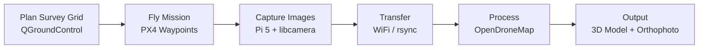

# Photogrammetry Pipeline

Photogrammetry is the process of reconstructing 3D geometry from overlapping 2D photographs. By capturing many images of the same scene from different angles, software can triangulate the 3D position of features visible across multiple photos. The result is a dense point cloud, a textured 3D mesh, and a georeferenced orthophoto --- all from ordinary camera images.

Bennu uses photogrammetry for outdoor site survey: mapping terrain, structures, or construction sites from the air. The drone flies a grid pattern, captures geotagged images, and a ground-based processing pipeline (OpenDroneMap) handles the reconstruction.

## The Pipeline

The photogrammetry workflow has six stages, from mission planning to final output.

### 1. Plan

Define a survey grid in QGroundControl using its Survey mission item. The key parameters are:

- **Altitude:** 50--80 m (balances resolution and coverage)
- **Front overlap:** 75--80% (consecutive images along a flight line)
- **Side overlap:** 65--70% (between adjacent flight lines)
- **Camera trigger:** Distance-based, every ~5 m (`TRIG_DIST` parameter in PX4)

Higher overlap means more images and longer processing, but produces better reconstructions. The overlap ensures every point on the ground appears in multiple images from different angles.

### 2. Fly

PX4 executes the waypoint mission autonomously. The drone follows the grid pattern at constant altitude and speed while PX4's camera trigger module fires at the configured distance interval. The pilot monitors progress via QGroundControl over the telemetry radio link.

### 3. Capture

On each trigger event, PX4 publishes a `CameraTrigger` message over uXRCE-DDS. The `bennu_camera` ROS2 node on the Pi 5:

1. Captures a full-resolution image via `libcamera-still`
2. Reads the drone's current position from PX4 (`VehicleGlobalPosition`)
3. Writes GPS coordinates, altitude, and heading into the image's EXIF metadata
4. Saves the geotagged JPEG to local storage

### 4. Transfer

After the drone lands, images are transferred from the Pi 5 to the ground station PC. The `sync_images.sh` script uses `rsync` over the Pi's WiFi connection (~30 m range). For larger datasets, the Pi's microSD card can be physically swapped.

### 5. Process

OpenDroneMap (via the WebODM web interface) processes the geotagged images through a Structure from Motion (SfM) pipeline:

1. **Feature detection** --- Identify distinctive visual features (corners, edges, blobs) in each image using algorithms like SIFT or SuperPoint
2. **Feature matching** --- Find the same features across overlapping images to establish correspondences
3. **Structure from Motion (SfM)** --- Estimate camera positions and 3D feature locations from the matched features
4. **Multi-View Stereo (MVS)** --- Generate a dense point cloud by matching pixels across all image pairs
5. **Mesh generation** --- Connect the dense points into a triangulated surface mesh
6. **Texturing** --- Project the original images onto the mesh to create a photorealistic surface
7. **Orthophoto and DSM** --- Generate a top-down georeferenced image (orthophoto) and a Digital Surface Model (elevation map)

### 6. Output

The pipeline produces several output formats:

| Output | Format | Description |
|---|---|---|
| Point cloud | `.ply`, `.laz` | 3D points with color, viewable in CloudCompare |
| 3D mesh | `.obj` | Textured surface model |
| Orthophoto | `.tif` (GeoTIFF) | Georeferenced top-down image, like a high-res satellite photo |
| Digital Surface Model | `.tif` (GeoTIFF) | Elevation map of the surveyed area |

## Pipeline Diagram

## Key Concepts

### Image Overlap

Overlap is the percentage of shared area between consecutive images. Photogrammetry requires every ground point to appear in at least 3--5 images for reliable 3D reconstruction. Bennu targets 75--80% front overlap (along the flight direction) and 65--70% side overlap (between parallel flight lines).

Too little overlap creates holes in the reconstruction. Too much overlap wastes flight time and storage without significantly improving quality. The 75/65% default is a well-established baseline for survey drones.

### Ground Sample Distance (GSD)

GSD is the real-world size of one pixel at ground level. It depends on the camera sensor, lens focal length, and flight altitude. With the Pi HQ Camera (IMX477, 1.55 um pixel pitch) and a 6 mm lens at 60 m altitude:

> GSD = (pixel pitch x altitude) / focal length = (1.55 um x 60 m) / 6 mm ~ 1.6 cm/pixel

This means each pixel in the captured image represents roughly 1.6 cm on the ground. Lower altitude gives finer resolution but covers less area per image, requiring more flight lines.

### EXIF GPS Tags

Every image captured by Bennu includes GPS metadata in its EXIF headers: latitude, longitude, altitude (MSL), and heading. OpenDroneMap reads these tags to establish initial camera positions before running SfM. Without GPS tags, the software would need to solve for camera positions from scratch, which is slower and less reliable for large datasets.

The `bennu_camera` node writes GPS data from PX4's `VehicleGlobalPosition` topic, which fuses GPS receiver data with IMU measurements through the EKF2 state estimator. This gives sub-meter position accuracy --- sufficient for photogrammetry, which refines positions during the SfM step.

### Structure from Motion (SfM)

SfM is the core algorithm behind photogrammetry. It works by:

1. Finding the same visual features (like a corner of a building) across multiple images
2. Using the known geometry of perspective projection to estimate where each camera was when it took each photo
3. Triangulating the 3D position of each matched feature from the estimated camera positions

The result is a sparse 3D point cloud and a set of refined camera poses. Multi-View Stereo (MVS) then densifies this sparse cloud into millions of points by matching pixels across all image pairs, producing the detailed 3D model.

SfM is why overlap matters: features must appear in multiple images from different viewpoints for triangulation to work. It is also why GPS tags help: they provide a strong initial estimate of camera positions, reducing the search space for feature matching.
