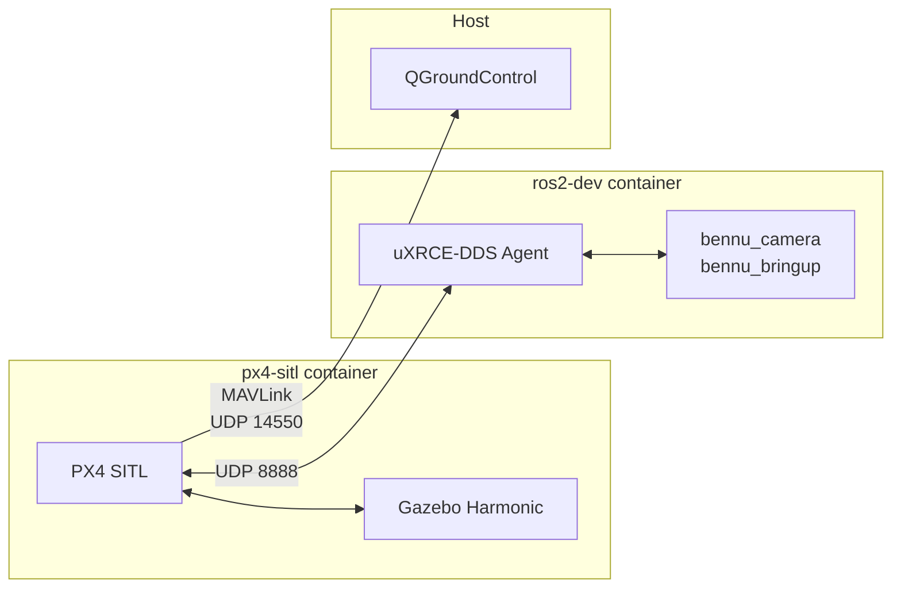

# Simulation Stack

## Why Simulate?

Testing drone software on real hardware requires a clear field, charged batteries, favorable weather, and the acceptance that a bug might crash a $800 aircraft. Simulation removes all of those constraints. The PX4 SITL (Software-In-The-Loop) environment runs the real PX4 firmware on your development machine, connected to Gazebo for physics and rendering. ROS2 nodes talk to the simulated PX4 through the same uXRCE-DDS interface they would use on real hardware.

This means you can:

- Iterate on ROS2 node logic without flying
- Test mission plans and camera trigger behavior
- Validate uXRCE-DDS message flows end-to-end
- Develop on any machine with Docker --- no Pi 4, no Pixhawk, no drone

## Architecture

The simulation stack runs two Docker containers orchestrated by Docker Compose.

### px4-sitl Container

This container runs two tightly coupled processes:

- **PX4 SITL** --- The full PX4 firmware compiled for the host architecture (x86_64 or aarch64) instead of the STM32H743. It behaves identically to the real firmware: same EKF2, same navigator, same camera trigger module. The only difference is that sensor data comes from Gazebo instead of physical IMUs and GPS.

- **Gazebo Harmonic** --- The physics simulator. It models the quadcopter's dynamics (gravity, thrust, drag, inertia), simulates GPS and IMU sensors, and provides 3D visualization. PX4 sends motor commands to Gazebo and receives simulated sensor data back.

### ros2-dev Container

This container mirrors what runs on the Pi 4:

- **uXRCE-DDS Agent** --- Bridges PX4 topics into ROS2, exactly as it does on hardware. The only difference is the transport: UDP instead of UART serial.

- **Bennu ROS2 packages** --- `bennu_camera` and `bennu_bringup` run in simulation mode. The camera node generates placeholder JPEG images instead of calling `libcamera`, but still writes GPS EXIF metadata from PX4's simulated position data.

The `ros2_ws` source directory is bind-mounted into the container, so code changes on the host are immediately available inside the container without rebuilding the Docker image.

## Communication

The simulation replicates the same communication architecture as real hardware, substituting UDP for physical links.

### PX4 to QGroundControl

PX4 SITL sends MAVLink on UDP port 14550. Both containers use host networking, so QGroundControl running on the host auto-discovers the simulated drone and behaves as if it were connected to a real drone via telemetry radio. You can upload missions, monitor telemetry, and tune parameters.

### PX4 to uXRCE-DDS

PX4 SITL runs its built-in uXRCE-DDS client over UDP port 8888. The uXRCE-DDS Agent in the ros2-dev container connects to this port and publishes PX4 topics as ROS2 topics. On real hardware, this same link runs over UART at 921600 baud on the Pixhawk's TELEM2 port.

### Container Networking

Both containers use host networking (`network_mode: host`), so they communicate via localhost --- no port mapping or service-name resolution needed. GPU passthrough for hardware-accelerated Gazebo rendering is available as a separate compose file (`docker-compose.debug.yml`).

## Simulation Diagram

## Sim Mode Behavior

The `use_sim:=true` launch argument switches Bennu's ROS2 nodes into simulation mode. This is passed through the `bennu_bringup` launch file and affects behavior at two levels:

### uXRCE-DDS Agent Transport

- **Hardware (`use_sim:=false`):** Connects via serial device `/dev/ttyAMA0` at 921600 baud
- **Simulation (`use_sim:=true`):** Connects via UDP to the px4-sitl container on port 8888

### Camera Node Behavior

- **Hardware:** Calls `libcamera-still` to capture a real image from the Pi HQ Camera
- **Simulation:** Creates a placeholder JPEG file (no camera hardware needed)

In both modes, the camera node subscribes to `VehicleGlobalPosition` and writes GPS coordinates into the image's EXIF metadata. In simulation, these coordinates come from Gazebo's simulated GPS, so the full geotagging pipeline is exercised even without hardware.

## Hardware vs Simulation

| Aspect | Hardware | Simulation |
|---|---|---|
| PX4-ROS2 transport | UART (TELEM2, 921600 baud) | UDP 8888 |
| Camera | `libcamera-still` (real images) | Placeholder JPEG |
| GPS | M9N hardware receiver | Gazebo simulated GPS |
| Physics | Real world | Gazebo Harmonic |
| Launch argument | `use_sim:=false` | `use_sim:=true` |
| QGC connection | Telemetry radio (MAVLink) | UDP 14550 (localhost, host networking) |
| Start command | Manual launch on Pi 4 | `make sim` (one command from repo root) |

The goal is to minimize the difference between simulation and hardware. The same ROS2 nodes, the same launch files, and the same uXRCE-DDS protocol are used in both environments. Only the transport layer and camera backend change.
