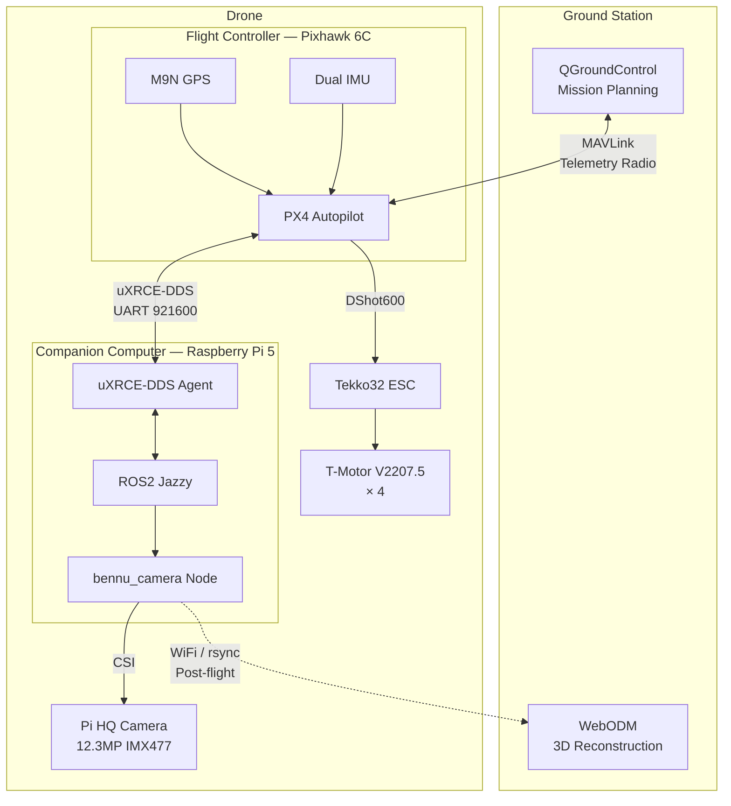

# System Architecture

Bennu is split into three subsystems, each with a clear responsibility: the **Drone** flies and captures geotagged images, the **Ground Station** plans missions and monitors telemetry, and the **Processing Pipeline** reconstructs 3D models from the captured data. This separation of concerns keeps flight-critical code isolated from intelligence and processing workloads, which is the same pattern used by commercial drone platforms.

Bennu is evolving toward a data-acquisition platform that exports versioned, signed **mission bundles** — a standardized directory of images, metadata, telemetry, and quality reports. These bundles can be processed locally with WebODM (the current pipeline) or ingested by an independent geospatial analysis platform. See the [Platform Readiness Design](../plans/2026-03-08-drone-platform-readiness-design.md) for details.

## Hardware Architecture

### Flight Controller --- Pixhawk 6C

The Holybro Pixhawk 6C runs PX4 Autopilot on an STM32H743 processor. It handles everything that must never fail mid-air: attitude stabilization, GPS navigation, failsafe logic (return-to-launch, geofence, low battery), and motor output via DShot600. The FC has dual redundant IMUs for reliability and a dedicated TELEM2 serial port wired to the companion computer.

The flight controller is intentionally kept simple. It does not run ROS2 nodes, process images, or make high-level decisions. Its only job is to keep the drone in the air and follow waypoints.

### Companion Computer --- Raspberry Pi 5

The Pi 5 (8 GB) is the intelligence layer. It runs Ubuntu 24.04 with ROS2 Jazzy and hosts the uXRCE-DDS agent that bridges PX4 topics into the ROS2 ecosystem. It drives the camera over CSI, handles geotagging by subscribing to PX4 position data, and assembles signed mission bundles for export.

### Camera --- Pi HQ Camera (IMX477)

The Raspberry Pi HQ Camera provides 12.3 MP resolution through a 6 mm CS-mount lens. It connects to the Pi 5 via the CSI ribbon cable and is driven by `libcamera`. At a survey altitude of 50--80 m, the 6 mm lens delivers roughly 2 cm/pixel ground sample distance (GSD), which is sufficient for site survey and photogrammetry.

### GPS --- M9N

The Holybro M9N module provides position fixes and a built-in magnetometer (compass). It feeds position, velocity, and heading data into PX4's EKF2 state estimator. The GPS is mounted on a 30 mm carbon fiber mast to reduce magnetic interference from the power distribution system.

### Propulsion --- Tekko32 ESC + T-Motor V2207.5

A Holybro Tekko32 F4 4-in-1 50A ESC drives four T-Motor Velox V2207.5 1950KV motors via DShot600. The 4-in-1 form factor simplifies wiring. With 7-inch tri-blade props and a 4S LiPo, the system provides 15--20 minutes of flight time at survey speeds.

### Separation of Concerns

The split between flight controller and companion computer is deliberate:

- **FC (Pixhawk 6C):** Real-time, safety-critical. Runs a deterministic RTOS. If the Pi crashes, the FC can still fly, hold position, or return to launch.
- **Companion (Pi 5):** Non-critical intelligence. Runs Linux. Can be rebooted or updated without affecting flight safety.

This architecture means a software bug in a ROS2 node cannot cause a crash. The worst case is a failed image capture, not a failed flight.

## Software Architecture

| Layer | Platform | Software | Role |
|---|---|---|---|
| Flight Controller | Pixhawk 6C | PX4 Autopilot v1.16+ | Stabilization, navigation, failsafes, camera trigger |
| Companion Computer | Raspberry Pi 5 | ROS2 Jazzy, uXRCE-DDS Agent | Camera capture, geotagging, future autonomy |
| Ground Station | PC | QGroundControl | Mission planning, telemetry, parameter tuning |
| Processing | PC (Docker) | WebODM / OpenDroneMap | 3D reconstruction from geotagged images |
| Data Export | Pi 5 → Ground Station | Mission bundle (v1 contract) | Signed dataset package for platform ingestion |

PX4 includes a built-in uXRCE-DDS client. On the Pi 5, the Micro-XRCE-DDS Agent translates PX4's internal topics (vehicle position, camera trigger events, battery status) into standard ROS2 topics. This is a first-class integration --- no MAVLink parsing, no MAVROS, no message translation layers.

## Communication Flow

```
QGroundControl ←── MAVLink (telemetry radio, 433/915 MHz) ──→ PX4
PX4            ←── uXRCE-DDS (UART 921600 baud, TELEM2) ──→ Pi 5
Pi 5           ←── CSI ribbon cable ──────────────────────→ Pi HQ Camera
Pi 5           ──── WiFi / rsync (post-flight) ──────────→ Ground Station PC
```

Three distinct communication channels serve different purposes:

1. **MAVLink over telemetry radio** --- Real-time telemetry between the drone and QGroundControl. Used for mission upload, live monitoring, and parameter tuning. Range depends on radio (SiK radios: ~1 km, Crossfire: 10+ km).

2. **uXRCE-DDS over UART** --- High-bandwidth link between PX4 and ROS2 on the Pi 5. Carries position data, sensor readings, and camera trigger events at 921600 baud. This is an onboard link (30 cm wire), so bandwidth and latency are not concerns.

3. **WiFi / rsync** --- Bulk image transfer after the drone lands. The Pi 5's built-in WiFi (~30 m range) is not used in flight. Images are synced to the ground station for processing.

## System Diagram



## Three-Phase Deployment

Bennu is designed to be built and flown incrementally. Each phase adds capability without reworking what came before.

### Phase 1: Manual FPV

Build the frame, wire the flight controller and propulsion system, flash PX4, and fly manually with an RC transmitter. The goal is to validate flight stability, tune PID gains, and confirm endurance. No companion computer or camera needed.

### Phase 2: Survey + Camera

Add the Pi 5 and Pi HQ Camera. Establish the uXRCE-DDS serial link between the Pi and Pixhawk. Plan waypoint survey missions in QGroundControl with distance-based camera triggering. The Pi captures geotagged images during flight. Post-flight, images are either processed locally with WebODM or packaged as a signed mission bundle for platform ingestion.

### Phase 3: Autonomy (Future)

Replace QGroundControl mission planning with onboard ROS2 nodes. A coverage planner generates survey grids from area polygons, executes the mission, and assembles signed mission bundles autonomously. This phase may require upgrading to a Jetson for onboard SLAM or obstacle avoidance.
