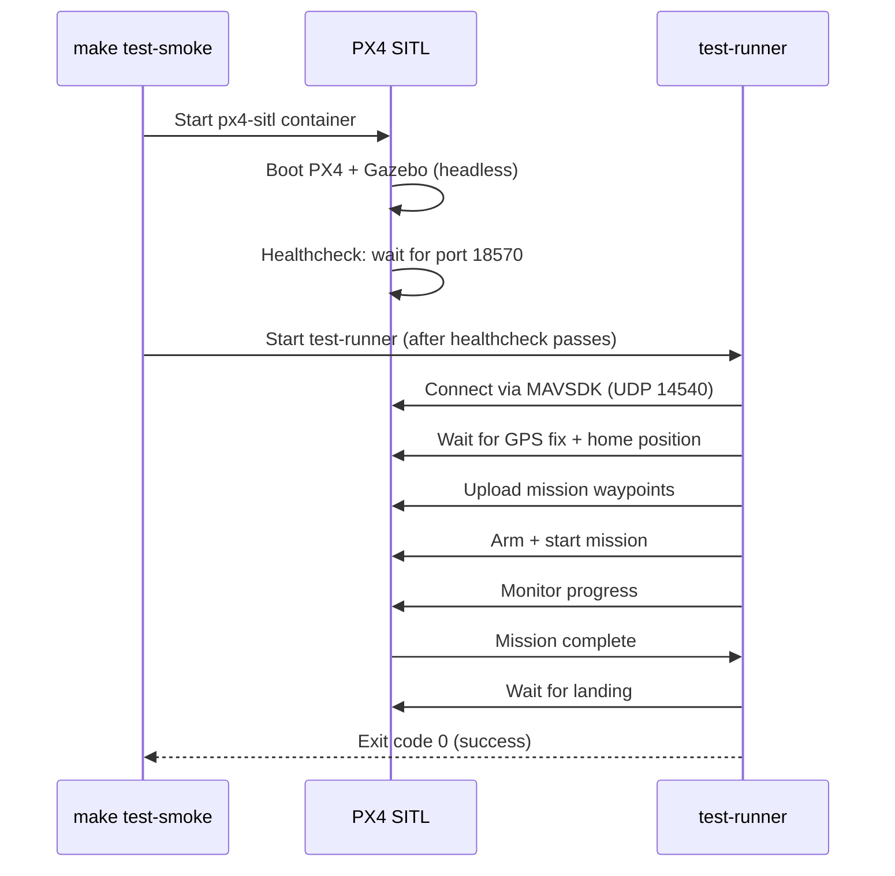

# Run SIL Tests

Run automated Software-in-the-Loop (SIL) mission tests against PX4 SITL. These tests fly the simulated drone through a complete mission — takeoff, waypoints, camera triggers, RTL, landing — and verify the outcome.

!!! abstract "Prerequisites"

    - Docker and Docker Compose installed
    - First run pulls ~4GB of prebuilt images from GHCR (PX4 SITL + ROS2)
    - No GPU required (headless mode)

## Quick Start

```bash
cd sim
make test-smoke
```

This starts PX4 SITL + Gazebo (headless), waits for GPS lock, runs the default survey mission, and exits with code 0 on success or 1 on failure. Containers are cleaned up automatically.

## How It Works



## Scenario Files

SIL tests are driven by YAML scenario files in `sim/scenarios/`. Each scenario defines a mission profile and expected outcomes.

### Scenario Format

```yaml
name: nominal_survey
description: Baseline happy path — flat world, small grid
world: default
vehicle: x500
mission:
  type: grid
  altitude_m: 30
  speed_mps: 3
  waypoints: 6
  trigger_distance_m: 10
camera_backend: placeholder
assertions:
  min_triggers: 4
  expected_end_state: landed
  max_duration_s: 180
  require_bundle: false
```

| Field | Description |
|-------|-------------|
| `name` | Scenario identifier (used in logs) |
| `mission.altitude_m` | Flight altitude in meters |
| `mission.speed_mps` | Cruise speed in m/s |
| `mission.waypoints` | Number of waypoints to generate in a lawnmower grid |
| `mission.trigger_distance_m` | Distance-based camera trigger interval |
| `assertions.max_duration_s` | Timeout — fail if mission takes longer |
| `assertions.expected_end_state` | Expected final state (`landed`) |
| `assertions.min_triggers` | Minimum camera triggers expected |

### Available Scenarios

| Scenario | File | Description |
|----------|------|-------------|
| `nominal_survey` | `scenarios/nominal_survey.yaml` | Baseline happy path — 6 waypoints, 30m altitude, flat world |

### Writing a New Scenario

Create a YAML file in `sim/scenarios/`:

```yaml
name: high_altitude_survey
description: Survey at 80m with tighter waypoint spacing
world: default
vehicle: x500
mission:
  type: grid
  altitude_m: 80
  speed_mps: 5
  waypoints: 10
  trigger_distance_m: 5
camera_backend: placeholder
assertions:
  min_triggers: 8
  expected_end_state: landed
  max_duration_s: 300
  require_bundle: false
```

Run it:

```bash
cd sim
docker compose -f docker-compose.sil.yml run --rm test-runner \
  python3 /ros2_ws/scripts/run_mission.py \
  --scenario /ros2_ws/scenarios/high_altitude_survey.yaml
```

Or run all scenarios:

```bash
cd sim
make test-sitl
```

## Make Targets

| Command | What it does |
|---------|-------------|
| `make test-smoke` | Run default SIL mission (nominal_survey) |
| `make test-sitl` | Run all scenarios in `sim/scenarios/` |
| `make test` | Run unit tests only (no PX4 needed) |
| `make test-all` | Run unit tests + SIL test |
| `make clean` | Stop all containers and remove volumes |

## Timeouts and Timing

SIL tests have multiple timeout layers:

| Timeout | Default | Where |
|---------|---------|-------|
| PX4 healthcheck | 345s max (45s start + 30x10s) | `docker-compose.sil.yml` |
| MAVSDK connection | 5 retries with exponential backoff | `run_mission.py` |
| PX4 readiness (GPS lock) | 180s | `run_mission.py --timeout` |
| Mission duration | 180s (per scenario) | `assertions.max_duration_s` |
| Landing wait | 60s | `run_mission.py` (hardcoded) |
| GitHub Actions job | 30 min | `sil-smoke.yml` |

!!! tip "Slow machines"

    If PX4 takes too long to get GPS lock, increase the readiness timeout:

    ```bash
    docker compose -f docker-compose.sil.yml run --rm test-runner \
      python3 /ros2_ws/scripts/run_mission.py \
      --scenario /ros2_ws/scenarios/nominal_survey.yaml \
      --timeout 300
    ```

## Debugging Failures

### PX4 never becomes healthy

The healthcheck waits for UDP port 18570 to open. If it never passes:

```bash
# Check PX4 logs
docker logs bennu-px4-sitl-sil 2>&1 | tail -50

# Common causes:
# - Port conflict (another PX4 instance running)
# - Insufficient memory for Gazebo
```

### MAVSDK can't connect

```
[run_mission] Connection attempt 1 failed: ...
[run_mission] Retrying in 1s...
```

The test-runner retries up to 5 times with exponential backoff. If all attempts fail:

```bash
# Verify PX4 is actually listening
docker exec bennu-px4-sitl-sil grep ':388C ' /proc/net/udp
# 388C = port 14540 (MAVSDK offboard API)
```

### GPS lock timeout

```
[run_mission] TIMEOUT: PX4 not ready
```

PX4 SITL GPS simulation takes 30-120s depending on machine speed. On slow CI runners this can exceed the default timeout.

```bash
# Run with longer timeout
make test-smoke TIMEOUT=300
```

### Mission timeout

```
[run_mission] TIMEOUT: mission did not complete in 180s
```

The mission took longer than `assertions.max_duration_s`. Either increase the timeout in the scenario YAML or reduce the number of waypoints.

### Inspecting Artifacts

Failed runs save artifacts to `sim/artifacts/`:

```bash
ls sim/artifacts/
```

In GitHub Actions, artifacts are uploaded automatically on failure and can be downloaded from the workflow run page.

## CI Integration

SIL tests run automatically on:

- Pull requests to `main`
- Weekday schedule (6am UTC)
- Manual dispatch (`gh workflow run sil-smoke.yml`)

The CI workflow pulls prebuilt Docker images from GHCR instead of building from source, saving ~15 minutes per run.

!!! warning "Known CI Timing Issue"

    GitHub Actions shared runners are slower than local machines. PX4 GPS lock can take longer than expected. The healthcheck and connection timeouts are tuned for this, but occasional flaky failures may occur. Re-run the workflow if it times out.
