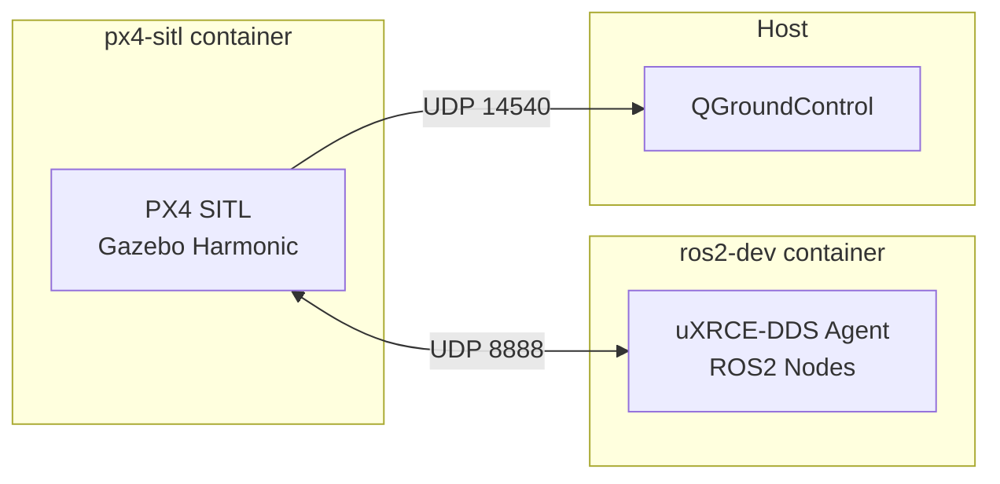

# Run the Gazebo SITL Simulation

Launch the full Bennu software stack in simulation using Docker. The simulation
runs PX4 SITL with Gazebo Harmonic for physics and rendering, while a second
container provides the ROS2 Jazzy environment with the uXRCE-DDS agent.

!!! abstract "Prerequisites"

    - [Docker](https://docs.docker.com/get-docker/) and Docker Compose installed
    - [QGroundControl](https://docs.qgroundcontrol.com/master/en/qgc-user-guide/getting_started/download_and_install.html) installed on the host
    - X11 display server running (for the Gazebo GUI)

## Architecture

The simulation uses two Docker containers communicating over UDP:



## Start the Simulation

### 1. Allow X11 Access for Docker

```bash
xhost +local:docker
```

### 2. Build and Launch

```bash
cd sim
docker compose -f docker-compose.sim.yml up --build
```

Gazebo opens in a new window showing the x500 quadcopter model.

### 3. Connect QGroundControl

Open QGroundControl -- it auto-connects to PX4 SITL on `udp://localhost:14540`.

## NVIDIA GPU Acceleration (optional)

If you have an NVIDIA GPU, enable hardware-accelerated Gazebo rendering:

```bash
sudo bash sim/setup_nvidia_docker.sh
```

This installs the NVIDIA Container Toolkit and configures Docker to use CDI
device passthrough. After running the script, restart the simulation.

## Phase 1: Fly in QGC

Use QGroundControl to plan waypoint missions, test takeoff, landing, and RTL
(Return to Launch). No ROS2 nodes are needed for this phase.

## Phase 2: Test ROS2 Nodes

Open a shell in the ROS2 container and launch the Bennu nodes:

```bash
docker exec -it bennu-ros2-dev bash
source /ros2_ws/install/setup.bash
ros2 launch bennu_bringup drone.launch.py use_sim:=true
```

To inspect available topics:

```bash
docker exec -it bennu-ros2-dev bash
ros2 topic list
```

## Stop the Simulation

```bash
cd sim
docker compose -f docker-compose.sim.yml down
```
