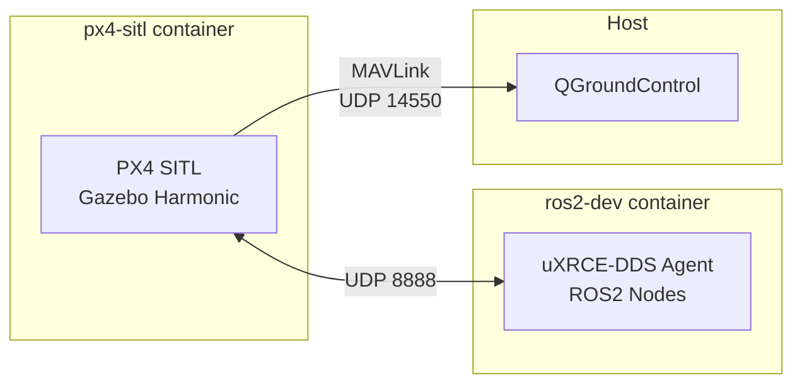

# Run the Gazebo SITL Simulation

Launch the full Bennu software stack in simulation using Docker. The simulation
runs PX4 SITL with Gazebo Harmonic for physics and rendering, while a second
container provides the ROS2 Jazzy environment with the uXRCE-DDS agent.

!!! abstract "Prerequisites"

    - [Docker](https://docs.docker.com/get-docker/) and Docker Compose installed
    - [QGroundControl](https://docs.qgroundcontrol.com/master/en/qgc-user-guide/getting_started/download_and_install.html) installed on the host
    - NVIDIA GPU with Container Toolkit installed (for GUI mode)
    - X11 display server running (for GUI mode)

## Architecture

The simulation uses two Docker containers communicating over UDP:



## Compose Environments

The simulation stack is split into three Docker Compose files for different
use cases. A Makefile in `sim/` wraps all Docker Compose commands.

| Environment | Compose File | Make Target | Use Case |
|---|---|---|---|
| Dev | `docker-compose.dev.yml` | `make dev` | Interactive development, pytest-watch |
| SIL | `docker-compose.sil.yml` | `make test-sitl` | Headless CI, automated mission tests |
| Debug | `docker-compose.debug.yml` | `make dev-debug` | Gazebo 3D GUI with GPU passthrough |

## Start the Simulation

### Headless Mode (default)

```bash
cd sim
make dev
```

PX4 SITL starts with Gazebo physics running in the background. You can fly
the drone using QGroundControl without the 3D window.

To start dev mode with pytest-watch auto-rerunning tests on file changes:

```bash
cd sim
make dev-watch
```

### GUI Mode (with Gazebo 3D window)

To see the drone in the Gazebo 3D viewport, use the debug profile which adds
NVIDIA GPU passthrough and X11 forwarding:

```bash
# Allow Docker containers to access your display (run once per login session)
xhost +local:docker

# Launch with Gazebo GUI enabled
cd sim
make dev-debug
```

Gazebo opens in a new window showing the x500 quadcopter model.

### Connect QGroundControl

Open QGroundControl --- it auto-connects to PX4 SITL via MAVLink on
`localhost:14550`. Both containers use host networking, so no port mapping is
needed.

## NVIDIA GPU Setup (required for GUI mode)

GUI mode requires an NVIDIA GPU with the Container Toolkit installed:

```bash
sudo bash sim/setup_nvidia_docker.sh
```

This installs the NVIDIA Container Toolkit, generates a CDI specification, and
configures Docker to pass through the GPU. After running the script, restart
Docker and the simulation.

!!! warning "Gazebo GUI crashes with OpenGL error"

    If you see `Failed to create OpenGL context` in the logs, the GPU is not
    accessible inside the container. Check:

    1. **X11 access** --- run `xhost +local:docker` on the host
    2. **NVIDIA drivers** --- run `nvidia-smi` on the host to confirm drivers are loaded
    3. **Container GPU access** --- run `docker exec bennu-px4-sitl nvidia-smi` to verify the GPU is visible inside the container
    4. **CDI spec** --- run `nvidia-ctk cdi generate --output=/etc/cdi/nvidia.yaml` if the CDI spec is missing

## Run Tests

```bash
cd sim

# Unit, contract, and integration tests (no PX4 needed)
make test-unit

# Full mission SIL test (headless, requires PX4 SITL)
make test-sitl

# Run all scenario tests
make test-scenarios

# Run all tests
make test-all
```

For detailed SIL testing guidance — scenarios, timeouts, debugging — see [Run SIL Tests](run-sil-tests.md).

## Fly the Drone

Once the simulation is running and QGroundControl shows a green **Ready to Fly**
status bar, you can fly the simulated drone. No ROS2 nodes are needed for this ---
QGroundControl talks directly to PX4 over MAVLink.

### Takeoff

1. Click the **Takeoff** button in the bottom-left action bar (Fly view).
2. Confirm the takeoff altitude (default ~2.5 m) and slide to confirm.
3. The drone arms, spins up motors, and climbs to the target altitude.

### Fly to a Point

Click anywhere on the map and choose **Go to location**. The drone flies to that
point at its current altitude.

### Plan a Waypoint Mission

1. Switch to the **Plan** tab (top toolbar).
2. Click on the map to add waypoints. Each waypoint gets a default altitude you
   can adjust in the sidebar.
3. Click **Upload** (top-right) to send the mission to PX4.
4. Switch back to the **Fly** tab and click **Start Mission**.

The drone takes off, flies the waypoints in order, and returns to launch.

### Land

- **Land** --- click the **Land** button to land at the current position.
- **RTL** (Return to Launch) --- click **RTL** to fly back to the takeoff point
  and land automatically. This is the same behavior as the real drone's failsafe.

## Test ROS2 Nodes

Open a shell in the ROS2 container and launch the Bennu nodes:

```bash
docker exec -it bennu-ros2-dev bash
source /ros2_ws/install/setup.bash
ros2 launch bennu_bringup drone.launch.py use_sim:=true
```

To inspect available topics:

```bash
docker exec -it bennu-ros2-dev bash
ros2 topic list
```

## Access the PX4 Console

To interact with the PX4 shell (`pxh>`), open a separate terminal and exec
into the running container:

```bash
docker exec -it bennu-px4-sitl bash -c '/opt/px4/build/px4_sitl_default/bin/px4-mavlink-shell'
```

Alternatively, use QGroundControl's built-in MAVLink console
(**Analyze > MAVLink Console**).

## Stop the Simulation

```bash
cd sim
make clean
```

## All Make Targets

Run `cd sim && make help` to see all available commands:

```
dev                  Start dev environment (headless PX4 + ros2-dev shell)
dev-watch            Start dev + pytest-watch auto-rerun
dev-debug            Start debug environment with Gazebo GUI (requires GPU + xhost)
test-unit            Run unit + contract + integration tests (no PX4)
test-sitl            Run full mission SIL headless
test-scenarios       Run scenario matrix
test-all             Run unit + sitl tests
clean                Stop all containers, remove volumes
help                 Show available commands
```
