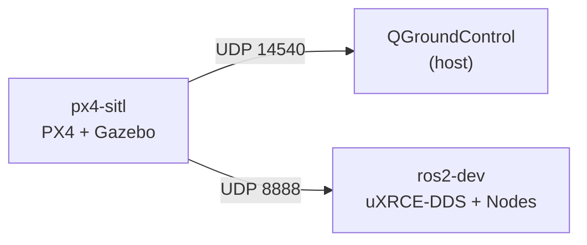
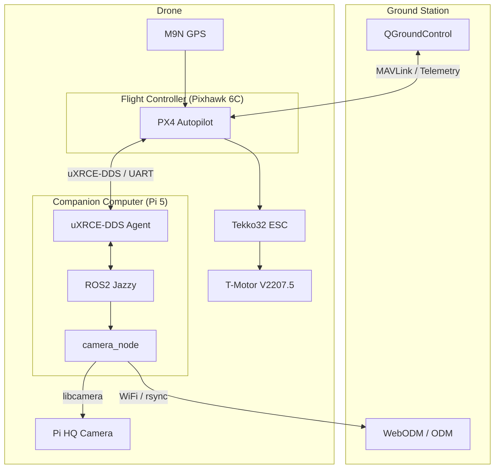
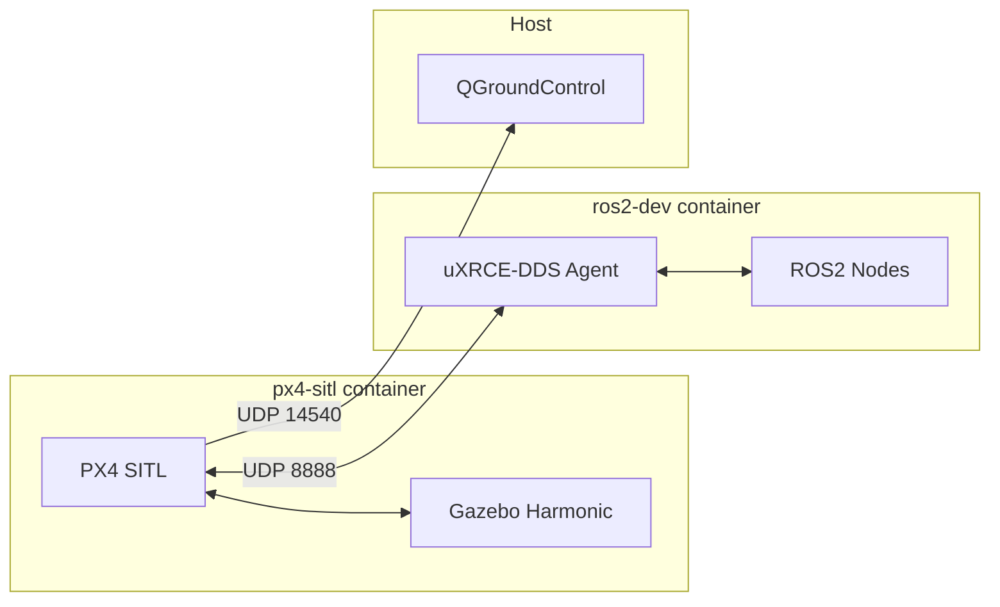
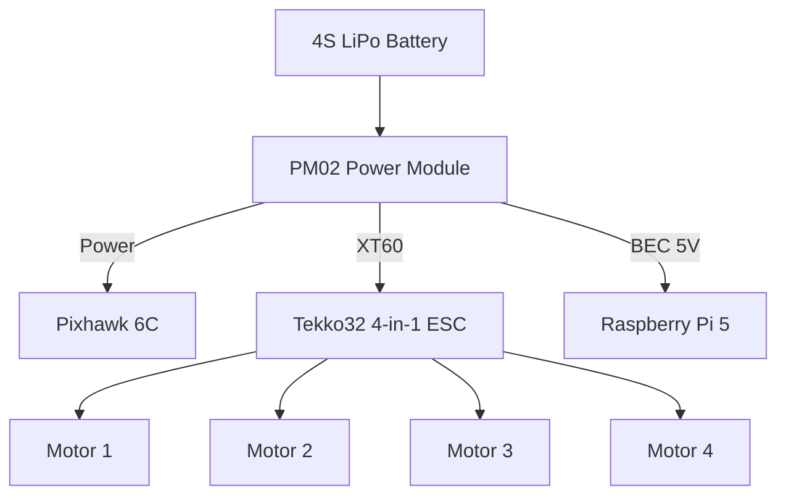

# Documentation System Implementation Plan

> **For Claude:** REQUIRED SUB-SKILL: Use superpowers:executing-plans to implement this plan task-by-task.

**Goal:** Set up a MkDocs Material documentation site with Diátaxis structure, ADRs, and build log, deployed to GitHub Pages.

**Architecture:** MkDocs Material renders Markdown docs into a static site. Content is extracted from existing project files into a Diátaxis structure (Tutorials, How-to, Concepts, Reference) plus ADRs and a blog-based build log. GitHub Actions auto-deploys on push to main.

**Tech Stack:** MkDocs Material, pymdownx extensions (Mermaid, admonitions, tabs), GitHub Actions, GitHub Pages

**Design doc:** `docs/plans/2026-03-08-documentation-system-design.md`

---

### Task 1: MkDocs Foundation

**Files:**
- Create: `requirements-docs.txt`
- Create: `mkdocs.yml`
- Create: `.github/workflows/docs.yml`

**Step 1: Create requirements-docs.txt**

```
mkdocs-material>=9.6
mkdocs-material[imaging]
```

The blog plugin and mermaid support are built into mkdocs-material >= 9.6.

**Step 2: Create mkdocs.yml**

```yaml
site_name: Bennu
site_description: DIY Photogrammetry Drone — PX4 + ROS2 + OpenDroneMap
site_url: https://fadi-labib.github.io/bennu/
repo_url: https://github.com/fadi-labib/bennu
repo_name: fadi-labib/bennu

theme:
  name: material
  features:
    - navigation.tabs
    - navigation.sections
    - navigation.top
    - search.suggest
    - search.highlight
    - content.code.copy
    - content.tabs.link
  palette:
    - media: "(prefers-color-scheme: light)"
      scheme: default
      primary: deep orange
      accent: orange
      toggle:
        icon: material/brightness-7
        name: Switch to dark mode
    - media: "(prefers-color-scheme: dark)"
      scheme: slate
      primary: deep orange
      accent: orange
      toggle:
        icon: material/brightness-4
        name: Switch to light mode
  icon:
    repo: fontawesome/brands/github

markdown_extensions:
  - admonition
  - pymdownx.details
  - pymdownx.superfences:
      custom_fences:
        - name: mermaid
          class: mermaid
          format: !!python/name:pymdownx.superfences.fence_mermaid
  - pymdownx.tabbed:
      alternate_style: true
  - pymdownx.highlight:
      anchor_linenums: true
  - pymdownx.inlinehilite
  - pymdownx.snippets
  - pymdownx.mark
  - attr_list
  - md_in_html
  - tables
  - toc:
      permalink: true

plugins:
  - search
  - blog:
      blog_dir: blog

nav:
  - Home: index.md
  - Tutorials:
      - tutorials/index.md
      - Frame Assembly: tutorials/frame-assembly.md
  - How-to Guides:
      - how-to/index.md
      - Flash PX4 Parameters: how-to/flash-px4-params.md
      - Run the Simulation: how-to/run-simulation.md
      - Transfer Images: how-to/transfer-images.md
      - Start WebODM: how-to/start-webodm.md
  - Concepts:
      - concepts/index.md
      - System Architecture: concepts/system-architecture.md
      - Photogrammetry Pipeline: concepts/photogrammetry-pipeline.md
      - Simulation Stack: concepts/simulation-stack.md
  - Reference:
      - reference/index.md
      - Bill of Materials: reference/bill-of-materials.md
      - Wiring Diagram: reference/wiring-diagram.md
      - Frame Specifications: reference/frame-specifications.md
      - PX4 Parameters: reference/px4-parameters.md
      - ROS2 Interfaces: reference/ros2-interfaces.md
  - Decisions:
      - decisions/index.md
      - ADR-001 PX4 over ArduPilot: decisions/001-px4-over-ardupilot.md
      - ADR-002 Pi 5 Companion: decisions/002-pi5-companion-computer.md
      - ADR-003 Rolling Shutter Camera: decisions/003-rolling-shutter-camera.md
      - ADR-004 uXRCE-DDS over MAVROS: decisions/004-uxrce-dds-over-mavros.md
  - Build Log: blog/index.md
```

**Step 3: Create GitHub Actions workflow**

Create `.github/workflows/docs.yml`:

```yaml
name: Deploy Docs

on:
  push:
    branches: [main]
    paths:
      - 'docs/**'
      - 'mkdocs.yml'
      - 'requirements-docs.txt'
      - '.github/workflows/docs.yml'
  workflow_dispatch:

permissions:
  contents: write

jobs:
  deploy:
    runs-on: ubuntu-latest
    steps:
      - uses: actions/checkout@v4
      - uses: actions/setup-python@v5
        with:
          python-version: '3.12'
      - run: pip install -r requirements-docs.txt
      - run: mkdocs gh-deploy --force
```

**Step 4: Verify MkDocs installs locally**

Run: `cd /home/fadi/projects/bennu && pip install -r requirements-docs.txt`
Expected: Successful install of mkdocs-material and dependencies.

**Step 5: Commit**

```bash
git add requirements-docs.txt mkdocs.yml .github/workflows/docs.yml
git commit -m "docs: add MkDocs Material configuration and CI workflow"
```

---

### Task 2: Landing Page and Section Index Pages

**Files:**
- Create: `docs/index.md`
- Create: `docs/tutorials/index.md`
- Create: `docs/how-to/index.md`
- Create: `docs/concepts/index.md`
- Create: `docs/reference/index.md`
- Create: `docs/decisions/index.md`
- Create: `docs/blog/index.md`
- Create: `docs/blog/posts/.gitkeep`

**Step 1: Create docs/index.md**

The landing page introduces the project with a high-level overview and links to each section.
Content should include:
- Project name and tagline ("DIY 3D-printed 7" quadcopter for outdoor photogrammetry")
- A brief "What is Bennu?" paragraph
- Tech stack highlights (PX4, ROS2, Pi 5, OpenDroneMap)
- A "Getting Started" section pointing to Tutorials
- Grid/cards linking to each section with 1-line descriptions using MkDocs Material grid syntax

**Step 2: Create section index pages**

Each section index page should have:
- A title and 2-3 sentence description of the section's purpose (per Diátaxis)
- Links to the pages within the section

Create these files:
- `docs/tutorials/index.md` — "Learning-oriented guides that walk you through building and operating Bennu."
- `docs/how-to/index.md` — "Task-oriented recipes for common operations."
- `docs/concepts/index.md` — "Understanding-oriented explanations of how Bennu works and why."
- `docs/reference/index.md` — "Information-oriented technical specifications and data."
- `docs/decisions/index.md` — "Architecture Decision Records (ADRs) documenting key design choices." Include the ADR template here.
- `docs/blog/index.md` — Empty file (the blog plugin auto-generates the index).
- `docs/blog/posts/.gitkeep` — Empty file to ensure the directory exists.

**Step 3: Verify build**

Run: `cd /home/fadi/projects/bennu && mkdocs build --strict 2>&1 | tail -20`
Expected: Build succeeds (warnings about missing pages are OK at this stage since content pages don't exist yet — use `mkdocs build` without `--strict` if needed).

**Step 4: Commit**

```bash
git add docs/index.md docs/tutorials/index.md docs/how-to/index.md docs/concepts/index.md docs/reference/index.md docs/decisions/index.md docs/blog/
git commit -m "docs: add landing page and section index pages"
```

---

### Task 3: Tutorials — Frame Assembly

**Files:**
- Create: `docs/tutorials/frame-assembly.md`

**Source:** `docs/build-guide/01-frame-assembly.md`

**Step 1: Create docs/tutorials/frame-assembly.md**

Extract the full content from `docs/build-guide/01-frame-assembly.md` and enhance it:

- Keep the 8-step assembly process (heat-set inserts → landing gear)
- Keep the weight budget table
- Add MkDocs admonitions for safety warnings (e.g., `!!! warning "Soldering required"`)
- Add admonitions for tips (e.g., `!!! tip`)
- Add a "Prerequisites" section with tools and materials using admonition blocks
- Add a "What you'll learn" intro paragraph (tutorial style per Diátaxis)
- Convert any ASCII diagrams to Mermaid if applicable

**Step 2: Verify build**

Run: `cd /home/fadi/projects/bennu && mkdocs build --strict 2>&1 | tail -5`
Expected: Clean build, no errors.

**Step 3: Commit**

```bash
git add docs/tutorials/frame-assembly.md
git commit -m "docs: add frame assembly tutorial"
```

---

### Task 4: How-to Guides

**Files:**
- Create: `docs/how-to/flash-px4-params.md`
- Create: `docs/how-to/run-simulation.md`
- Create: `docs/how-to/transfer-images.md`
- Create: `docs/how-to/start-webodm.md`

**Step 1: Create docs/how-to/flash-px4-params.md**

Source: `firmware/px4/flash.sh`, `firmware/px4/upload_params.sh`, `firmware/px4/VERSION`, and the 6 YAML param files in `firmware/px4/params/`.

Content:
- Brief intro: "How to flash PX4 firmware and upload Bennu's parameter configuration."
- Prerequisites: QGroundControl installed, Pixhawk connected via USB
- Section 1: Flash firmware — document `firmware/px4/flash.sh` usage
- Section 2: Upload parameters — document `firmware/px4/upload_params.sh` usage
- Section 3: Parameter overview — table summarizing each YAML file (base, motor, GPS, companion, camera, tuning) with key parameters and their purposes
- Use `!!! note` admonitions for important notes (e.g., "Tuning params are starting values — tune in flight")

**Step 2: Create docs/how-to/run-simulation.md**

Source: `sim/README.md`, `sim/docker-compose.sim.yml`, `sim/setup_nvidia_docker.sh`.

Content:
- Brief intro: "How to run the Gazebo SITL simulation for testing without hardware."
- Prerequisites: Docker, NVIDIA GPU (optional), QGroundControl
- Section 1: NVIDIA GPU setup (optional) — document `sim/setup_nvidia_docker.sh`
- Section 2: Start the simulation — `docker compose -f docker-compose.sim.yml up`
- Section 3: Connect QGroundControl — UDP 14540
- Section 4: Test ROS2 nodes — attach to ros2-dev container
- Convert the ASCII architecture diagram to Mermaid:



**Step 3: Create docs/how-to/transfer-images.md**

Source: `ground/transfer/sync_images.sh`.

Content:
- Brief intro: "How to transfer captured images from the drone's Pi 5 to your ground station."
- Prerequisites: Pi 5 powered on, WiFi connected, SSH configured
- Usage of `sync_images.sh` with options
- Where images land on the ground station

**Step 4: Create docs/how-to/start-webodm.md**

Source: `ground/odm/docker-compose.yml`, `ground/odm/process.sh`, `ground/odm/profiles/survey_standard.json`.

Content:
- Brief intro: "How to start WebODM and process aerial images into 3D models."
- Prerequisites: Docker installed
- Section 1: Start WebODM — `cd ground/odm && docker compose up -d`
- Section 2: Access the UI — `http://localhost:8000`
- Section 3: Process images — document `process.sh` usage
- Section 4: Processing profiles — explain `survey_standard.json`

**Step 5: Verify build**

Run: `cd /home/fadi/projects/bennu && mkdocs build --strict 2>&1 | tail -5`
Expected: Clean build, no errors.

**Step 6: Commit**

```bash
git add docs/how-to/
git commit -m "docs: add how-to guides for PX4, simulation, transfer, and WebODM"
```

---

### Task 5: Concepts

**Files:**
- Create: `docs/concepts/system-architecture.md`
- Create: `docs/concepts/photogrammetry-pipeline.md`
- Create: `docs/concepts/simulation-stack.md`

**Step 1: Create docs/concepts/system-architecture.md**

Source: `docs/plans/2026-03-08-drone-photogrammetry-design.md` (architecture and software stack sections).

Content:
- Overview of the full system: ground station ↔ drone ↔ processing
- Hardware architecture (Pixhawk 6C, Pi 5, camera, GPS, ESCs, motors)
- Software architecture (PX4, uXRCE-DDS, ROS2, camera node)
- Communication flow between components
- Convert ASCII architecture diagram to Mermaid flowchart:



- Three-phase deployment summary (Manual FPV → Survey → Autonomy)

**Step 2: Create docs/concepts/photogrammetry-pipeline.md**

Source: `docs/plans/2026-03-08-drone-photogrammetry-design.md` (photogrammetry pipeline section).

Content:
- What is photogrammetry? (brief, 2-3 sentences)
- The 6-step pipeline: Plan → Fly → Capture → Transfer → Process → Output
- Each step explained with what happens, what tools are involved
- Convert to Mermaid sequence or flowchart diagram
- Image overlap and GSD concepts
- Role of EXIF GPS tags in reconstruction
- How OpenDroneMap / WebODM processes the images

**Step 3: Create docs/concepts/simulation-stack.md**

Source: `docs/plans/2026-03-08-gazebo-sitl-design.md`.

Content:
- Why simulate? (test without hardware, iterate faster)
- Architecture: two Docker containers (px4-sitl + ros2-dev)
- PX4 SITL with Gazebo Harmonic
- uXRCE-DDS bridge over UDP (sim) vs UART (hardware)
- `use_sim:=true` launch argument and what it changes
- Camera node sim mode (placeholder JPEG generation)
- Convert communication flow to Mermaid:



**Step 4: Verify build**

Run: `cd /home/fadi/projects/bennu && mkdocs build --strict 2>&1 | tail -5`
Expected: Clean build, no errors.

**Step 5: Commit**

```bash
git add docs/concepts/
git commit -m "docs: add concept pages for architecture, photogrammetry, and simulation"
```

---

### Task 6: Reference Pages

**Files:**
- Create: `docs/reference/bill-of-materials.md`
- Create: `docs/reference/wiring-diagram.md`
- Create: `docs/reference/frame-specifications.md`
- Create: `docs/reference/px4-parameters.md`
- Create: `docs/reference/ros2-interfaces.md`

**Step 1: Create docs/reference/bill-of-materials.md**

Source: `docs/plans/2026-03-08-drone-photogrammetry-design.md` (BOM section).

Content:
- Three tables matching the design doc:
  - Flight Controller & Electronics (~$350-400)
  - Camera System (~$70)
  - Companion Computer (~$100)
- Each row: Component, Part, Price, Notes/Rationale
- Total cost summary
- Use `!!! info` admonition for "Prices as of 2026, subject to change"

**Step 2: Create docs/reference/wiring-diagram.md**

Source: `docs/wiring/wiring-diagram.md`.

Content:
- Power distribution diagram converted to Mermaid:



- Signal connections diagram as Mermaid
- Pi 5 connections table
- Important notes as admonitions (cross-wire UART, voltage warnings)

**Step 3: Create docs/reference/frame-specifications.md**

Source: `frame/README.md`.

Content:
- Frame dimensions and specs table
- Printed parts list
- Non-printed components (tubes, hardware)
- Print settings table (material, temps, infill, etc.)
- CAD file locations

**Step 4: Create docs/reference/px4-parameters.md**

Source: `firmware/px4/params/*.yaml` (all 6 files).

Content:
- Overview of parameter organization
- Table for each param file with: Parameter name, Value, Description
- Files: base, motor, GPS, companion, camera, tuning
- Use tabbed content (`=== "Base"`, `=== "Motor"`, etc.) for clean organization
- `!!! warning` for tuning params ("Starting values only — tune in flight")

**Step 5: Create docs/reference/ros2-interfaces.md**

Source: `drone/ros2_ws/src/bennu_camera/` and `drone/ros2_ws/src/bennu_bringup/`.

Content:
- Packages overview (bennu_camera, bennu_bringup)
- Subscribed topics table: Topic name, Message type, Description
  - `/fmu/out/vehicle_global_position` — VehicleGlobalPosition — GPS position
  - `/fmu/out/camera_trigger` — CameraTrigger — PX4 camera trigger signal
- Published topics: (none currently)
- Node parameters table: Parameter, Default, Description
  - output_dir, image_width, image_height, use_sim
- Launch arguments table: Argument, Default, Description
  - use_sim, output_dir, serial_port, baud_rate

**Step 6: Verify build**

Run: `cd /home/fadi/projects/bennu && mkdocs build --strict 2>&1 | tail -5`
Expected: Clean build, no errors.

**Step 7: Commit**

```bash
git add docs/reference/
git commit -m "docs: add reference pages for BOM, wiring, frame, PX4 params, and ROS2"
```

---

### Task 7: Architecture Decision Records

**Files:**
- Create: `docs/decisions/001-px4-over-ardupilot.md`
- Create: `docs/decisions/002-pi5-companion-computer.md`
- Create: `docs/decisions/003-rolling-shutter-camera.md`
- Create: `docs/decisions/004-uxrce-dds-over-mavros.md`

**Source:** `docs/plans/2026-03-08-drone-photogrammetry-design.md` — extract decision rationale from the design doc.

**Step 1: Create ADR-001 — PX4 over ArduPilot**

```markdown
# ADR-001: PX4 over ArduPilot

## Status

Accepted

## Context

Choosing a flight controller firmware for a photogrammetry drone that needs
tight ROS2 integration for autonomous waypoint missions and camera triggering.
Both PX4 and ArduPilot are mature open-source autopilots.

## Decision

Use PX4 v1.16+ as the flight controller firmware.

## Consequences

- **Native ROS2 support** via uXRCE-DDS — no bridge layer needed (ArduPilot
  requires MAVROS or a custom DDS integration)
- **Production-grade path** — PX4 is used by commercial drone companies,
  providing a realistic development experience
- **Smaller community** than ArduPilot for hobby use, but better documentation
  for ROS2 integration
- **Parameter ecosystem** is different from ArduPilot — existing ArduPilot
  tuning guides don't apply directly
```

**Step 2: Create ADR-002 — Raspberry Pi 5 as Companion Computer**

Context: Need an onboard computer for camera control, geotagging, and ROS2.
Decision: Pi 5 (8GB) running Ubuntu 24.04.
Consequences: Affordable, good ROS2 support, sufficient compute for camera + DDS. WiFi is ~30m range (post-flight transfer only). GPIO UART for PX4 communication. Power via BEC 5V.

**Step 3: Create ADR-003 — Rolling Shutter Camera (IMX477)**

Context: Need a camera for photogrammetry. Global shutter cameras have low resolution (1.6MP). Rolling shutter Pi HQ Camera has 12.3MP.
Decision: Use Pi HQ Camera (IMX477) with 6mm CS-mount lens despite rolling shutter.
Consequences: 12.3MP sufficient for photogrammetry. Rolling shutter can cause jello effect at high speeds — mitigate with slower survey speeds. Native Pi CSI interface, no USB bandwidth issues. ~$70 total (camera + lens).

**Step 4: Create ADR-004 — uXRCE-DDS over MAVROS**

Context: Need a bridge between PX4 and ROS2 on the companion computer.
Decision: Use uXRCE-DDS (PX4's native ROS2 interface) instead of MAVROS.
Consequences: Direct ROS2 topic access without MAVLink translation. Lower latency. Native PX4 support (MAVROS is a community-maintained bridge). Requires PX4 v1.14+ and specific TELEM2 configuration. Less community documentation than MAVROS but growing.

**Step 5: Verify build**

Run: `cd /home/fadi/projects/bennu && mkdocs build --strict 2>&1 | tail -5`
Expected: Clean build, no errors.

**Step 6: Commit**

```bash
git add docs/decisions/
git commit -m "docs: add architecture decision records (ADR-001 through ADR-004)"
```

---

### Task 8: Blog / Build Log Setup

**Files:**
- Verify: `docs/blog/index.md` (created in Task 2)
- Verify: `docs/blog/posts/.gitkeep` (created in Task 2)

The blog plugin is already configured in `mkdocs.yml` (Task 1). The blog directory
and `.gitkeep` were created in Task 2. No additional files needed.

**Step 1: Verify blog plugin works**

Run: `cd /home/fadi/projects/bennu && mkdocs build --strict 2>&1 | tail -5`
Expected: Clean build. The blog section should render with an empty posts list.

This task exists as a checkpoint — the build log is ready for posts.
Posts are added later as `docs/blog/posts/YYYY-MM-DD-title.md` with frontmatter:

```markdown
---
date: 2026-03-08
categories:
  - Build
---

# Post Title

Post content here.
```

---

### Task 9: Final Verification and Push

**Step 1: Full build verification**

Run: `cd /home/fadi/projects/bennu && mkdocs build --strict`
Expected: Clean build with no errors and no warnings.

**Step 2: Local preview**

Run: `cd /home/fadi/projects/bennu && mkdocs serve`
Expected: Site available at `http://127.0.0.1:8000/bennu/`. Verify:
- Navigation tabs work (Home, Tutorials, How-to, Concepts, Reference, Decisions, Build Log)
- Mermaid diagrams render
- Search works
- Dark mode toggle works
- Admonitions render correctly

**Step 3: Push to remote**

Run: `cd /home/fadi/projects/bennu && git push origin main`
Expected: GitHub Actions workflow triggers and deploys to GitHub Pages.

**Step 4: Verify GitHub Pages**

After the workflow completes, check: `https://fadi-labib.github.io/bennu/`
The site should be live with all content.

If GitHub Pages isn't enabled yet, go to repo Settings → Pages → Source: "Deploy from a branch" → Branch: `gh-pages` / `/ (root)`.
