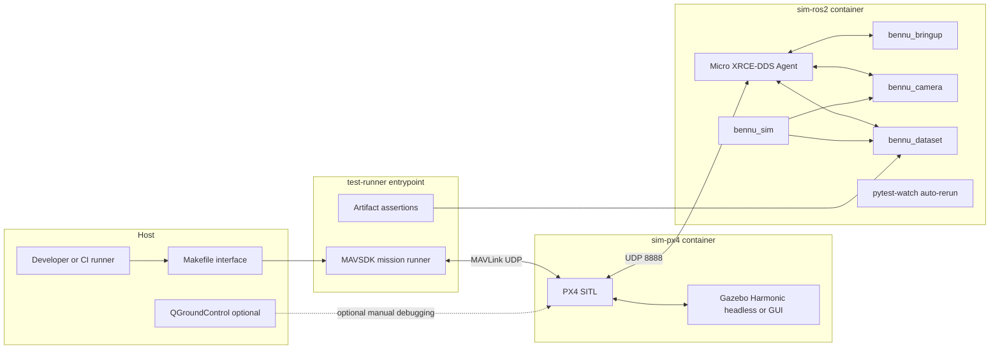

# Simulation-First SIL Design

**Date:** 2026-03-08
**Status:** Proposed

## Goal

Make simulation the default development interface for Bennu so that every
meaningful change can be tested locally and in CI before hardware is involved.

The target is not just "PX4 SITL runs." The target is:

- Bennu ROS2 packages run against the same PX4 interfaces used on hardware
- Mission execution is testable without QGroundControl
- Capture, geotagging, packaging, and quality checks are exercised in simulation
- Regressions are caught in minutes for common changes and in nightly scenario
  sweeps for deeper changes

## Why the Current Stack Is Not Enough

The current simulation stack is a good base, but it is still a side path:

- It is documented as a manual developer workflow, not the primary merge gate
- QGroundControl is still part of the nominal test flow
- The camera node falls back to placeholder images only when `libcamera-still`
  is missing instead of using an explicit simulation backend
- There is no non-interactive mission runner, scenario library, or regression
  harness
- CI does not run any simulation lane

## Core Stack

Keep **PX4 SITL + Gazebo Harmonic + ROS2 Jazzy** as the core environment.

Do not replace the stack with a heavier simulator. For Bennu, the best SIL
environment is the one that:

1. Matches PX4's native integration path
2. Runs headless in CI (GitHub Actions free tier, no GPU)
3. Exercises the Bennu ROS2 packages directly
4. Produces deterministic artifacts
5. Can later accept higher-fidelity sensor simulation without changing the test
   contract

This means:

- **PX4 SITL** remains the flight stack under test
- **Gazebo Harmonic** remains the physics backend
- **Micro XRCE-DDS Agent** remains the ROS2 bridge under test
- **MAVSDK test runner** is added for non-interactive mission control
- **Bennu simulation backends** are added for camera, faults, and scenario
  orchestration
- **Mission bundle validation** becomes part of the simulation output contract

## Architecture



## Design Principles

### 1. Headless First

GUI is optional. Every required test must run without Gazebo GUI and without
QGroundControl.

### 2. Same Interfaces as Hardware

Use the same ROS2 topics, PX4 message types, launch files, and mission bundle
contract as hardware. Differences are behind explicit adapters.

### 3. Explicit Simulation Backends

Do not detect simulation by waiting for hardware commands to fail.

Bennu nodes select a backend explicitly:

- `camera_backend:=libcamera` — real hardware
- `camera_backend:=placeholder` — minimal valid JPEG, fastest
- `camera_backend:=rendered` — Gazebo camera sensor (future)
- `camera_backend:=replay` — feed recorded real-world images

### 4. Deterministic Scenarios

Every simulation run is attributable to:

- world
- vehicle model
- scenario definition
- mission definition
- software revision
- random seed

### 5. Artifact-Based Assertions

Tests do not stop at "node stayed up." They assert:

- mission state transitions
- trigger counts
- image output count
- metadata completeness (18 CSV columns)
- bundle layout (contract v1 structure)
- quality summaries
- signature verification
- failure behavior under injected faults

### 6. Everything in Docker

All test tiers run inside Docker containers. No local Python installs, no
"works on my machine." Volume mounts from host enable edit-test loops.

## Test Pyramid

### Tier 0: Unit and Contract Tests

Purpose: catch fast regressions in seconds.

Runs:

- Package-local unit tests (`<package>/test/`)
- Manifest and schema validation (`tests/contract/`)
- Integration tests (`tests/integration/`)
- Pure geometry and geotag calculations

No PX4, no Gazebo. Runs inside the `ros2-dev` container.

Trigger: **pytest-watch auto-reruns on file change** inside the dev container.

Command: `make test-unit`

Target: under 5 seconds.

### Tier 1: ROS2 Component SIL

Purpose: exercise Bennu nodes against simulated PX4 topic streams without full
physics.

Runs:

- `bennu_camera` against recorded or generated PX4 topic messages
- Explicit camera backends in simulation mode
- Mission bundle assembly from synthetic capture events

No Gazebo, no full PX4 SITL. Uses ROS2 bag replay or topic generators inside
the `ros2-dev` container.

Command: `make test-component`

Target: under 2 minutes. First merge gate after unit tests.

### Tier 2: Full Mission SIL

Purpose: validate end-to-end behavior with PX4 SITL and Gazebo.

Runs:

- Launch PX4 SITL and Gazebo headless
- Start Micro XRCE-DDS Agent
- Launch Bennu ROS2 stack with placeholder backend
- Upload a mission using MAVSDK
- Auto-arm, take off, fly grid, trigger captures, land
- Verify output artifacts (bundle, manifest, checksums, signature)

This is the main integration gate for drone behavior.

Command: `make test-sitl`

Target: under 10 minutes.

### Tier 3: Scenario Regression SIL

Purpose: validate fault handling and quality behavior.

Runs scenario matrix:

- Nominal survey
- Camera backend timeout
- GPS quality degradation
- Trigger dropout
- Low-battery RTL
- DDS agent restart

Command: `make test-scenarios`

Target: 20-40 minutes. Nightly CI and before release tags.

### Tier 4: Replay and Perception Regression

Purpose: validate data pipeline behavior using real imagery.

Runs:

- Replay captured real-world images through the mission bundle pipeline
- Compare outputs to golden manifests and quality summaries
- Later: synthetic rendered frames for camera and multisensor testing

Command: `make test-replay`

This prevents physics-only simulation from hiding data-pipeline regressions.

## Scenario Definitions

Scenarios are versioned YAML test assets:

```yaml
name: nominal_survey
world: flat_field
vehicle: x500
mission:
  type: grid
  altitude_m: 60
  speed_mps: 5
  rows: 4
faults: []
assertions:
  min_triggers: 24
  expected_end_state: landed
  max_position_error_m: 3.0
  require_bundle: true
```

### Initial Scenario Set

1. **Nominal survey** — happy path, complete bundle, all assertions pass
2. **Camera backend timeout** — capture failures, quality summary accounting
3. **GPS quality drop** — degraded metadata, no-crash behavior, manifest fields
4. **Trigger dropout** — count mismatch detection, partial coverage reporting
5. **Low battery RTL** — interrupted mission, partial bundle export
6. **DDS agent restart** — ROS2 resilience, reconnection behavior

## Simulation Modes

### Mode A: Metadata SIL

Fastest. Placeholder images, real mission control, real PX4 interfaces.

Use for: geotagging, trigger handling, bundle tests, quality pipeline wiring.

### Mode B: Rendered Camera SIL

Medium fidelity. Gazebo camera sensor renders synthetic images. Requires GPU.

Use for: timing, image throughput, visual regression, blur heuristics.

### Mode C: Replay SIL

Feeds recorded real captures through the same ROS2 and bundle code paths.

Use for: bundle stability, metadata mapping, downstream ingest regression.

This is especially important because the real product boundary is the dataset,
not just the flight path.

## Developer Interface

### Makefile Commands

```makefile
make dev            # Start dev container with optional Gazebo GUI
make dev-watch      # Start dev container + pytest-watch auto-rerun
make test-unit      # Run Tier 0 inside ros2-dev (instant)
make test-component # Run Tier 1 component SIL (< 2 min)
make test-sitl      # Run Tier 2 full mission SIL headless (< 10 min)
make test-scenarios # Run Tier 3 scenario matrix (20-40 min)
make test-replay    # Run Tier 4 replay regression
make test-all       # Run Tiers 0-2 sequentially
make clean          # Stop all containers, remove volumes
```

### Fast Local Loop (Coding)

1. `make dev-watch` — starts ros2-dev container with pytest-watch
2. Edit Python code on host — volumes sync to container
3. pytest-watch detects changes, reruns relevant unit tests (~1-2s)
4. When ready for integration: `make test-sitl` (~5-10 min)

### Deep Debug Loop

1. `make dev` with `GAZEBO_GUI=1`
2. Optionally connect QGroundControl
3. Run a named scenario manually
4. Inspect mission logs and artifacts

QGroundControl stays in the toolbox but is not part of the required test path.

## Repo Changes

### 1. Add `bennu_sim` ROS2 Package

```text
drone/ros2_ws/src/bennu_sim/
├── bennu_sim/
│   ├── camera_backends.py       # Backend registry + factory
│   ├── px4_topic_replay.py      # Replay PX4 messages for Tier 1
│   ├── scenario_runner.py       # Load + execute scenario YAML
│   ├── fault_injector.py        # Inject GPS drop, trigger loss, etc.
│   └── mission_assertions.py    # Validate artifacts post-mission
├── launch/
│   ├── sil_smoke.launch.py      # Tier 2: nominal mission
│   └── sil_mission.launch.py    # Tier 3: parameterized scenarios
├── config/
│   └── scenarios/               # YAML scenario definitions
└── test/
```

### 2. Refactor `bennu_camera` Around Backends

Current: simulation inferred when `libcamera-still` is absent.

Required: backend chosen by launch parameter.

```text
drone/ros2_ws/src/bennu_camera/bennu_camera/
├── camera_node.py               # Delegates to selected backend
├── capture_backend.py           # Abstract base class
├── backends/
│   ├── libcamera_backend.py     # Real hardware capture
│   ├── placeholder_backend.py   # Minimal valid JPEG (existing behavior)
│   ├── rendered_backend.py      # Gazebo camera sensor (future)
│   └── replay_backend.py       # Feed recorded images
├── quality.py
└── geotag.py
```

### 3. Add MAVSDK Mission Runner

Non-interactive mission control for automated testing:

```text
sim/
├── scenarios/
│   ├── nominal_survey.yaml
│   ├── gps_degraded.yaml
│   ├── trigger_dropout.yaml
│   └── low_battery_rtl.yaml
└── scripts/
    ├── wait_for_px4.py          # Poll PX4 until ready
    ├── run_mission.py           # MAVSDK: upload, arm, fly, land
    └── validate_artifacts.py    # Post-mission bundle assertions
```

### 4. Split Compose by Use Case

```text
sim/
├── docker-compose.dev.yml       # Interactive dev, optional GUI, pytest-watch
├── docker-compose.sil.yml       # Headless CI and local smoke tests
├── docker-compose.debug.yml     # GUI + QGC + extra logging
├── Dockerfile.px4               # Existing (unchanged)
├── Dockerfile.ros2              # Existing (add MAVSDK, pytest-watch)
└── Makefile                     # Developer interface
```

### 5. Prebuilt Docker Images on GHCR

CI pulls prebuilt images instead of building from source:

- `ghcr.io/fadi-labib/bennu/px4-sitl:v1.16.1` — PX4 + Gazebo Harmonic
- `ghcr.io/fadi-labib/bennu/ros2-dev:jazzy` — ROS2 + XRCE + MAVSDK + test deps

A separate GitHub Actions workflow rebuilds these images weekly or on
Dockerfile changes. CI jobs pull them in ~30 seconds instead of building for
~10 minutes.

### 6. Artifact Recording

Every Tier 2+ SIL run persists:

- PX4 ULog
- ROS2 logs
- Mission runner logs
- Generated images
- Generated mission bundle (or partial bundle)
- Scenario definition used

Failed CI runs become debuggable evidence, not opaque red jobs. GitHub Actions
uploads these as workflow artifacts.

## CI Design

### Pull Request Gates

#### `lint-and-unit` (required)

- Install dev deps, `pip install -e` all packages
- `ruff check .`
- `python -m pytest drone/ros2_ws/src/*/test/ tests/ -v`
- Target: under 3 minutes

#### `sil-smoke` (required)

- Pull prebuilt images from GHCR
- Run nominal survey scenario headless
- MAVSDK mission runner
- Artifact assertions (bundle, signature, schema, checksums)
- Upload artifacts on failure
- Target: under 10 minutes

### Nightly Gates

#### `sil-regression`

- Full scenario matrix (6 scenarios)
- Store logs and artifacts
- Target: 20-40 minutes

#### `replay-regression`

- Selected real-capture replay cases
- Mission bundle regression assertions

### Release Gates

Before release tags:

- Run all nightly gates
- Require zero failed scenarios
- Publish tested scenario matrix in release notes

## Definition of Done

Bennu is simulation-first when all of the following are true:

1. Every PR runs a headless full-mission SIL job
2. No developer needs QGroundControl for standard regression testing
3. `bennu_camera` simulation behavior is explicit and backend-driven
4. Failed simulation jobs publish enough artifacts to debug remotely
5. At least one degraded scenario runs automatically, not just the happy path
6. The same mission bundle contract is produced by simulation and hardware modes
7. `make test-unit` gives sub-5-second feedback with auto-rerun on file changes
8. Prebuilt Docker images on GHCR keep CI jobs under 10 minutes

## First Milestone

The best first milestone is not multisensor simulation. It is:

**One deterministic nominal survey scenario that launches PX4 SITL, flies a
mission automatically, triggers the camera node, writes geotagged outputs, and
verifies the resulting dataset artifacts.**

Until that exists, the rest of the simulation stack is still infrastructure
without a real regression signal.
