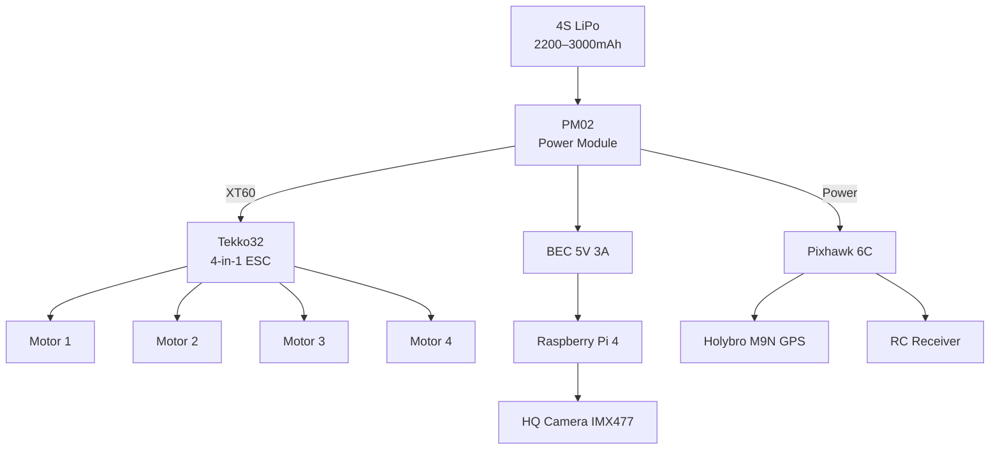

# Power Architecture

Power distribution for the Bennu drone — from battery to all subsystems.

## Power Chain

## Voltage Rails

| Rail | Voltage | Source | Consumers |
|------|---------|--------|-----------|
| Battery | 14.8V nominal (4S) | LiPo | PM02, ESC |
| Servo/FC | 5.3V | Pixhawk power module | Pixhawk 6C, GPS, RC receiver |
| Pi 4 | 5V | Dedicated BEC (min 3A) | Raspberry Pi 4, HQ Camera |

## Power Budget

| Component | Voltage | Current | Power |
|-----------|---------|---------|-------|
| 4x motors (hover) | 14.8V | ~4--6A total | ~60--90W |
| 4x motors (full throttle) | 14.8V | ~20--30A total | ~300--440W |
| Pixhawk 6C + GPS + RC rx | 5.3V | ~0.5A | ~2.5W |
| SiK telemetry radio | 5V | ~0.1A | ~0.5W |
| Raspberry Pi 4 | 5V | 1--2A | 5--10W |
| IMX477 camera | 5V (from Pi) | ~0.3A | ~1.5W |
| **Total at hover** | | | **~70--105W** |

## Flight Time Estimates

| Battery | Capacity | Energy | Est. hover time | Usable (land at 20%) |
|---------|----------|--------|-----------------|---------------------|
| 4S 2200mAh | 2.2Ah | 32.6Wh | ~19 min | ~15 min |
| 4S 3000mAh | 3.0Ah | 44.4Wh | ~25 min | ~20 min |

## Critical Design Rules

!!! danger "Power Isolation"
    The Raspberry Pi 4 **must** be powered by a dedicated BEC, not the Pixhawk servo rail.
    The Pi draws up to 2A under load — exceeding the servo rail capacity will brownout the flight controller.

!!! warning "BEC Selection"
    - Minimum 5V 3A continuous output
    - Must handle 4S input voltage (up to 16.8V fully charged)
    - Recommended: Matek UBEC 5V 3A or Pololu 5V 3.2A step-down

## Pi 4 Power Notes

- Pi 4 requires 5V ± 5% (4.75V–5.25V)
- Peak draw during boot: ~2A
- Steady state with camera: ~1.2A
- GPIO pins are 3.3V — do not connect 5V signals directly
- Camera connects via CSI ribbon cable (powered from Pi)

## Battery Safety

- Always use a battery voltage checker before flight
- PX4 monitors voltage via the Pixhawk power module
- Failsafe thresholds configured in `base_params.yaml`:
    - Low: 25% → Return to launch
    - Critical: 15% → Return to launch
    - Emergency: 10% → Land immediately
