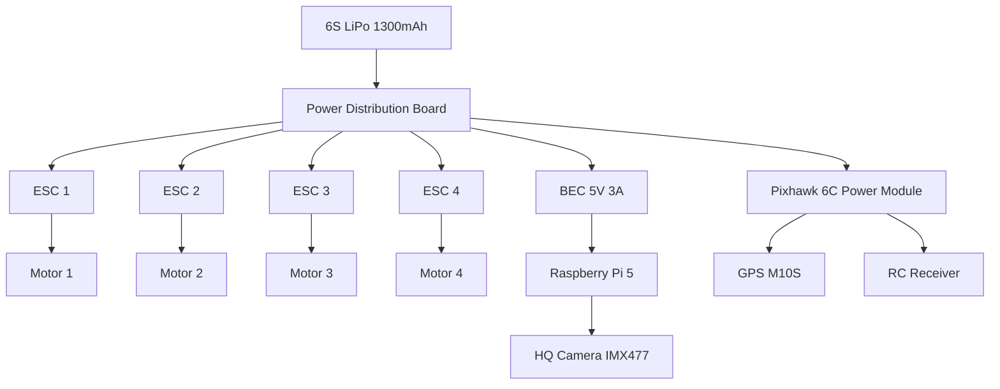

# Power Architecture

Power distribution for the Bennu drone — from battery to all subsystems.

## Power Chain

## Voltage Rails

| Rail | Voltage | Source | Consumers |
|------|---------|--------|-----------|
| Battery | 22.2V nominal (6S) | LiPo | ESCs, PDB |
| Servo/FC | 5.3V | Pixhawk power module | Pixhawk 6C, GPS, RC receiver |
| Pi 5 | 5V | Dedicated BEC (min 3A) | Raspberry Pi 5, HQ Camera |

## Critical Design Rules

!!! danger "Power Isolation"
    The Raspberry Pi 5 **must** be powered by a dedicated BEC, not the Pixhawk servo rail.
    The Pi draws up to 3A under load — exceeding the servo rail capacity will brownout the flight controller.

!!! warning "BEC Selection"
    - Minimum 5V 3A continuous output
    - Must handle 6S input voltage (up to 25.2V fully charged)
    - Recommended: Matek UBEC 5V 3A or Pololu 5V 3.2A step-down

## Pi 5 Power Notes

- Pi 5 requires 5V ± 5% (4.75V–5.25V)
- Peak draw during boot: ~2.5A
- Steady state with camera: ~1.5A
- GPIO pins are 3.3V — do not connect 5V signals directly
- Camera connects via CSI ribbon cable (powered from Pi)

## Battery Safety

- Always use a battery voltage checker before flight
- PX4 monitors voltage via the Pixhawk power module
- Failsafe thresholds configured in `base_params.yaml`:
    - Low: 25% → Return to launch
    - Critical: 15% → Return to launch
    - Emergency: 10% → Land immediately
