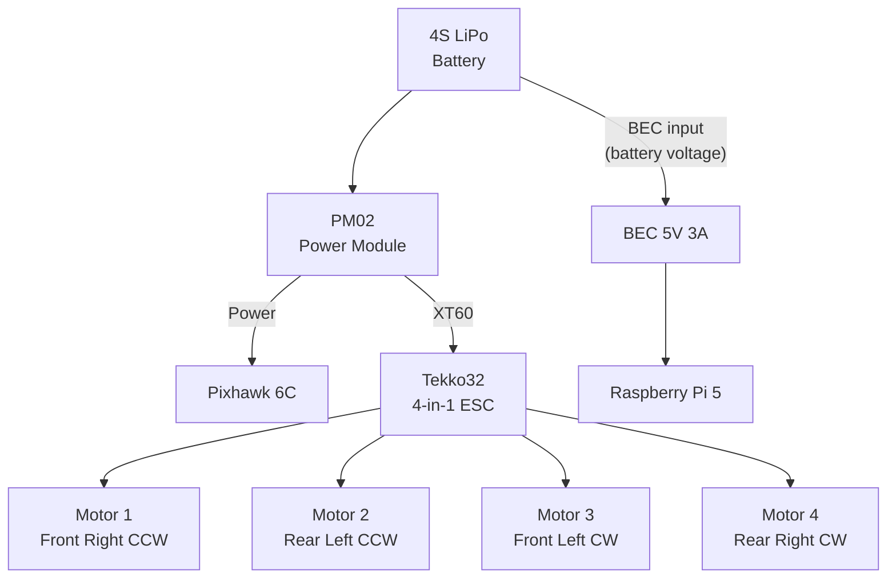

# Wiring Diagram

Electrical connections between all Bennu components.

## Power Distribution

## Signal Connections

| From | To | Connection | Notes |
|---|---|---|---|
| Pixhawk MAIN OUT 1-4 | ESC signal | DShot600 | Motor control |
| Pixhawk GPS1 | Holybro M9N GPS | UART/I2C | Position + compass |
| Pixhawk TELEM1 | SiK Radio | UART | Telemetry to QGC |
| Pixhawk TELEM2 TX | Pi 5 GPIO 15 (RX) | UART cross-wired | uXRCE-DDS |
| Pixhawk TELEM2 RX | Pi 5 GPIO 14 (TX) | UART cross-wired | uXRCE-DDS |
| Pixhawk RC IN | RC Receiver | SBUS/CRSF | RC control |
| Pi 5 CSI | Pi HQ Camera | Ribbon cable | Image capture |

!!! warning "Cross-Wire UART"
    The TELEM2 TX/RX lines must be cross-wired to Pi 5 GPIO: Pixhawk TX --> Pi RX (GPIO 15), Pixhawk RX --> Pi TX (GPIO 14). Do not connect TX-to-TX.

!!! warning "Voltage"
    Pi 5 GPIO is 3.3V only. Pixhawk TELEM2 is also 3.3V --- safe to connect directly. Never connect 5V signals to Pi GPIO.
